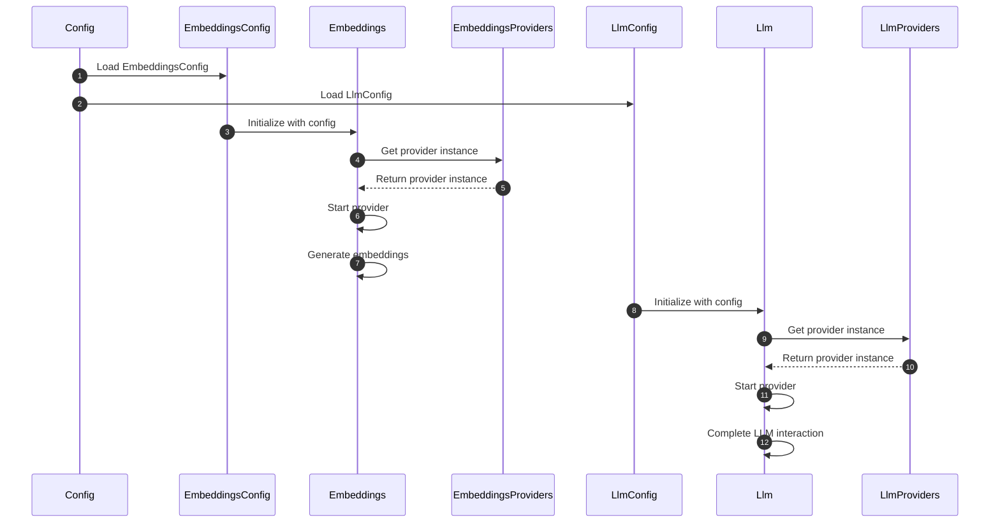

# AiCore Project

This project provides a framework for integrating various language models and embedding providers. It supports both synchronous and asynchronous operations for generating text completions and embeddings. The current implementation includes support for OpenAI, Mistral and Groq providers.

## Installation

To install the required dependencies, run:
```bash
pip install -r requirements.txt
```

## Usage

### Language Models

You can use the language models to generate text completions. Below is an example of how to use the `MistralLlm` provider:

```python
from aicore.llm.config import LlmConfig
from aicore.llm.providers import MistralLlm

config = LlmConfig(
    api_key="your_api_key",
    model="your_model_name",
    temperature=0.7,
    max_tokens=100
)

mistral_llm = MistralLlm.from_config(config)
response = mistral_llm.complete(prompt="Hello, how are you?")
print(response)
```

### Embeddings

You can use the embeddings module to generate text embeddings. Below is an example of how to use the `OpenAiEmbeddings` provider:

```python
from aicore.embeddings.config import EmbeddingsConfig
from aicore.embeddings import Embeddings

config = EmbeddingsConfig(
    provider="openai",
    api_key="your_api_key",
    model="your_model_name"
)

embeddings = Embeddings.from_config(config)
vectors = embeddings.generate(["Hello, how are you?"])
print(vectors)
```

For asynchronous usage:

```python
import asyncio
from aicore.embeddings.config import EmbeddingsConfig
from aicore.embeddings import Embeddings

async def main():
    config = EmbeddingsConfig(
        provider="openai",
        api_key="your_api_key",
        model="your_model_name"
    )

    embeddings = Embeddings.from_config(config)
    vectors = await embeddings.agenerate(["Hello, how are you?"])
    print(vectors)

asyncio.run(main())
```

### Loading from a Config File

To load configurations from a YAML file, set the `CONFIG_PATH` environment variable and use the `Config` class to load the configurations. Here is an example:

```python
from aicore.config import Config
from aicore.llm import Llm
import os

if __name__ == "__main__":
    os.environ["CONFIG_PATH"] = "./config/config.yml"
    config = Config.from_yaml()
    llm = Llm.from_config(config.llm)
    llm.complete("Once upon a time, there was a")
```

Make sure your `config.yml` file is properly set up with the necessary configurations.

**Disclaimer**: the following diagrams and explanations were Ai Generated

## Class Diagram

## Reasoning

The class diagram will represent the core components of the project, focusing on the key classes, their relationships, and critical dependencies. The main modules are `config`, `embeddings`, and `llm`, each with its own configuration, base providers, and specific implementations. The diagram will highlight the inheritance and composition relationships between these classes.

1. **Config Module**:
   - `Config`: Central configuration class that manages application settings, including embeddings and LLM configurations.

2. **Embeddings Module**:
   - `EmbeddingsConfig`: Configuration class for embedding providers.
   - `Embeddings`: Manages embedding generation using configured providers.
   - `BaseProvider`: Base class for embedding providers, defining common properties and methods.
   - `GroqEmbeddings`, `MistralEmbeddings`, `OpenAiEmbeddings`: Specific implementations of `BaseProvider` for different embedding providers.

3. **LLM Module**:
   - `LlmConfig`: Configuration class for LLM providers.
   - `Llm`: Manages configuration and interaction with various LLM providers.
   - `BaseProvider`: Abstract base class for LLM providers, defining common methods for configuration, completion, and normalization.
   - `GroqLlm`, `MistralLlm`, `OpenAiLlm`: Specific implementations of `BaseProvider` for different LLM providers.

The diagram will show the inheritance hierarchy and the composition relationships, such as how `Embeddings` and `Llm` classes use their respective `BaseProvider` implementations.

```mermaid
classDiagram
    class Config {
        +EmbeddingsConfig embeddings
        +LlmConfig llm
        +from_yaml(config_path: Optional[Union[str, Path]] = None) -> Config
    }

    class EmbeddingsConfig {
        +Literal provider
        +str api_key
        +Optional[str] model
        +Optional[str] base_url
    }

    class Embeddings {
        +EmbeddingsConfig config
        +BaseProvider _provider
        +provider: BaseProvider
        +vector_dimensions: int
        +start_provider() -> Self
        +from_config(config: EmbeddingsConfig) -> Embeddings
        +generate(text_batches: List[str])
        +agenerate(text_batches: List[str])
    }

    class BaseProvider {
        +EmbeddingsConfig config
        +int vector_dimensions
        +Any _client
        +Any _aclient
        +from_config(config: EmbeddingsConfig) -> BaseProvider
        +client: Any
        +aclient: Any
        +generate()
        +agenerate()
    }

    class GroqEmbeddings {
        +int vector_dimensions = 1024
        +set_groq() -> Self
        +generate(text_batches: List[str]) -> CreateEmbeddingResponse
        +agenerate(text_batches: List[str]) -> CreateEmbeddingResponse
    }

    class MistralEmbeddings {
        +int vector_dimensions = 1024
        +set_mistral() -> Self
        +generate(text_batches: List[str]) -> EmbeddingResponse
        +agenerate(text_batches: List[str]) -> EmbeddingResponse
    }

    class OpenAiEmbeddings {
        +int vector_dimensions = 1536
        +set_openai() -> Self
        +generate(text_batches: List[str]) -> CreateEmbeddingResponse
        +agenerate(text_batches: List[str]) -> CreateEmbeddingResponse
    }

    class LlmConfig {
        +Literal provider
        +str api_key
        +Optional[str] model
        +Optional[str] base_url
        +float temperature
        +int max_tokens
        +ensure_temperature_lower_than_unit(temperature: float) -> float
    }

    class Llm {
        +LlmConfig config
        +BaseProvider _provider
        +provider: BaseProvider
        +start_provider() -> Self
        +from_config(config: LlmConfig) -> Llm
        +tokenizer: Any
        +complete(prompt: Union[str, BaseModel, RootModel], system_prompt: Optional[str] = None, prefix_prompt: Optional[str] = None, img_path: Optional[Union[Union[str, Path], List[Union[str, Path]]]] = None, json_output: bool = False, stream: bool = True) -> Union[str, Dict]
        +acomplete(prompt: Union[str, BaseModel, RootModel], system_prompt: Optional[str] = None, prefix_prompt: Optional[str] = None, img_path: Optional[Union[Union[str, Path], List[Union[str, Path]]]] = None, json_output: bool = False, stream: bool = True) -> Union[str, Dict]
    }

    class BaseProvider {
        +LlmConfig config
        +Any _client
        +Any _aclient
        +Dict _completion_args
        +Any _completion_fn
        +Any _acompletion_fn
        +Any _normalize_fn
        +Any _tokenizer_fn
        +from_config(config: LlmConfig) -> BaseProvider
        +client: Any
        +aclient: Any
        +completion_args: Dict
        +completion_fn: Any
        +acompletion_fn: Any
        +normalize_fn: Any
        +tokenizer_fn: Any
        +get_default_tokenizer(model_name: str) -> str
        +_message_content(prompt: str, img_b64_str: Optional[List[str]] = None) -> List[Dict]
        +_message_body(prompt: str, role: Literal["user", "system", "assistant"] = "user", img_b64_str: Optional[List[str]] = None) -> Dict
        +completion_args_template(prompt: str, system_prompt: Optional[str] = None, prefix_prompt: Optional[str] = None, img_b64_str: Optional[Union[str, List[str]]] = None, stream: bool = False) -> Dict
        +_prepare_completion_args(prompt: str, system_prompt: Optional[str] = None, prefix_prompt: Optional[str] = None, img_path: Optional[Union[Union[str, Path], List[Union[str, Path]]]] = None, stream: bool = True) -> Dict
        +_stream(stream) -> str
        +_astream(stream) -> str
        +model_to_str(model: Union[BaseModel, RootModel]) -> str
        +extract_json(output: str) -> Dict
        +complete(prompt: Union[str, BaseModel, RootModel], system_prompt: Optional[str] = None, prefix_prompt: Optional[str] = None, img_path: Optional[Union[Union[str, Path], List[Union[str, Path]]]] = None, json_output: bool = False, stream: bool = True) -> Union[str, Dict]
        +acomplete(prompt: Union[str, BaseModel, RootModel], system_prompt: Optional[str] = None, prefix_prompt: Optional[str] = None, img_path: Optional[Union[Union[str, Path], List[Union[str, Path]]]] = None, json_output: bool = False, stream: bool = True) -> Union[str, Dict]
    }

    class GroqLlm {
        +set_groq() -> Self
        +normalize(chunk) -> Any
    }

    class MistralLlm {
        +set_mistral() -> Self
        +normalize(chunk) -> Any
    }

    class OpenAiLlm {
        +set_openai() -> Self
        +normalize(chunk) -> Any
    }

    Config "1" --> "1" EmbeddingsConfig : embeddings
    Config "1" --> "1" LlmConfig : llm

    Embeddings "1" --> "1" EmbeddingsConfig : config
    Embeddings "1" --> "1" BaseProvider : _provider

    BaseProvider <|-- GroqEmbeddings
    BaseProvider <|-- MistralEmbeddings
    BaseProvider <|-- OpenAiEmbeddings

    Llm "1" --> "1" LlmConfig : config
    Llm "1" --> "1" BaseProvider : _provider

    BaseProvider <|-- GroqLlm
    BaseProvider <|-- MistralLlm
    BaseProvider <|-- OpenAiLlm
```



## Sequence Diagram

## Reasoning

The sequence diagram will focus on the interactions between the core components of the system, highlighting the key messages and events critical to the system�s main functionalities. The core components include the central configuration class `Config`, the embedding-related classes `EmbeddingsConfig`, `Embeddings`, and `Providers` (for embeddings), and the LLM-related classes `LlmConfig`, `Llm`, and `Providers` (for LLM).

The diagram will illustrate the following workflow:
1. **Initialization**: The `Config` class loads the configuration settings, including embeddings and LLM configurations.
2. **Embeddings Configuration**: The `EmbeddingsConfig` class specifies provider details for embedding providers.
3. **Embeddings Generation**: The `Embeddings` class manages embedding generation using configured providers.
4. **LLM Configuration**: The `LlmConfig` class specifies provider details for LLM providers.
5. **LLM Interaction**: The `Llm` class manages configuration and interaction with various LLM providers.

The sequence diagram will show the high-level communication paths between these components, excluding utility or helper modules unless their interactions are essential to understanding the core logic. This approach ensures clarity and focuses on the primary workflow.




## License

This project is licensed under the Apache 2.0 License.