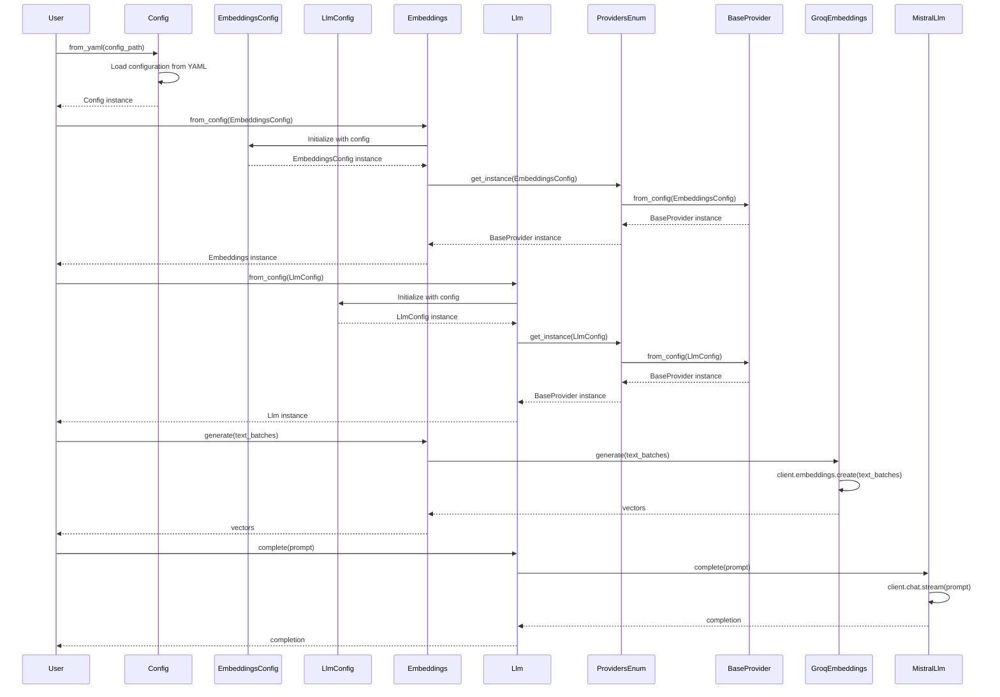

# AiCore Project

This project provides a framework for integrating various language models and embedding providers. It supports both synchronous and asynchronous operations for generating text completions and embeddings. The current implementation includes support for OpenAI, Mistral and Groq providers.

## Installation

To install the required dependencies, run:
```bash
pip install -r requirements.txt
```

## Usage

### Language Models

You can use the language models to generate text completions. Below is an example of how to use the `MistralLlm` provider:

```python
from aicore.llm.config import LlmConfig
from aicore.llm.providers import MistralLlm

config = LlmConfig(
    api_key="your_api_key",
    model="your_model_name",
    temperature=0.7,
    max_tokens=100
)

mistral_llm = MistralLlm.from_config(config)
response = mistral_llm.complete(prompt="Hello, how are you?")
print(response)
```

### Embeddings

You can use the embeddings module to generate text embeddings. Below is an example of how to use the `OpenAiEmbeddings` provider:

```python
from aicore.embeddings.config import EmbeddingsConfig
from aicore.embeddings import Embeddings

config = EmbeddingsConfig(
    provider="openai",
    api_key="your_api_key",
    model="your_model_name"
)

embeddings = Embeddings.from_config(config)
vectors = embeddings.generate(["Hello, how are you?"])
print(vectors)
```

For asynchronous usage:

```python
import asyncio
from aicore.embeddings.config import EmbeddingsConfig
from aicore.embeddings import Embeddings

async def main():
    config = EmbeddingsConfig(
        provider="openai",
        api_key="your_api_key",
        model="your_model_name"
    )

    embeddings = Embeddings.from_config(config)
    vectors = await embeddings.agenerate(["Hello, how are you?"])
    print(vectors)

asyncio.run(main())
```

### Loading from a Config File

To load configurations from a YAML file, set the `CONFIG_PATH` environment variable and use the `Config` class to load the configurations. Here is an example:

```python
from aicore.config import Config
from aicore.llm import Llm
import os

if __name__ == "__main__":
    os.environ["CONFIG_PATH"] = "./config/config.yml"
    config = Config.from_yaml()
    llm = Llm.from_config(config.llm)
    llm.complete("Once upon a time, there was a")
```

Make sure your `config.yml` file is properly set up with the necessary configurations.

** Disclaimer: the following diagrams and explanations were Ai Generated **

## Class Diagram

The class diagram will represent the core components of the project, focusing on the key classes and their relationships. The main modules are `config`, `embeddings`, and `llm`, each with its own configuration and provider classes. The diagram will highlight the inheritance and composition relationships between these classes, showing how the system is structured to handle different providers for embeddings and LLM functionalities.

### Key Components and Relationships:

1. **Config Class**:
   - Central configuration class that manages application settings, including embeddings and LLM configurations.
   - Contains `EmbeddingsConfig` and `LlmConfig` as attributes.

2. **Embeddings Module**:
   - **EmbeddingsConfig**: Configuration class for embedding providers.
   - **Embeddings**: Manages embedding generation using configured providers.
   - **Providers (Enum)**: Enumeration for instantiating provider classes based on the configuration.
   - **BaseProvider**: Base class for embedding providers, defining common properties and methods.
   - **Specific Providers (GroqEmbeddings, MistralEmbeddings, OpenAiEmbeddings)**: Implementations of `BaseProvider` for different embedding services.

3. **LLM Module**:
   - **LlmConfig**: Configuration class for LLM providers.
   - **Llm**: Manages configuration and interaction with various LLM providers.
   - **Providers (Enum)**: Enumeration for instantiating LLM provider classes based on the configuration.
   - **BaseProvider**: Base class for LLM providers, defining common properties and methods.
   - **Specific Providers (GroqLlm, MistralLlm, OpenAiLlm)**: Implementations of `BaseProvider` for different LLM services.

### Assumptions and Design Choices:
- The diagram will focus on the core classes and their relationships, omitting utility functions and minor details.
- Inheritance and composition relationships will be clearly depicted to show how the system is structured.
- Enumerations (`Providers`) will be included to show how provider classes are instantiated based on configuration.

```mermaid
classDiagram
    class Config {
        +EmbeddingsConfig embeddings
        +LlmConfig llm
        +from_yaml(config_path: Optional[Union[str, Path]] = None) -> Config
    }

    class EmbeddingsConfig {
        +Literal["groq", "mistral", "openai"] provider
        +str api_key
        +Optional[str] model
        +Optional[str] base_url
    }

    class LlmConfig {
        +Literal["groq", "mistral", "openai"] provider
        +str api_key
        +Optional[str] model
        +Optional[str] base_url
        +float temperature
        +int max_tokens
        +ensure_temperature_lower_than_unit(temperature: float) -> float
    }

    class Embeddings {
        +EmbeddingsConfig config
        +BaseProvider _provider
        +provider() -> BaseProvider
        +provider(provider: BaseProvider)
        +vector_dimensions() -> int
        +start_provider() -> Self
        +from_config(config: EmbeddingsConfig) -> Embeddings
        +generate(text_batches: List[str])
        +agenerate(text_batches: List[str])
    }

    class Llm {
        +LlmConfig config
        +BaseProvider _provider
        +provider() -> BaseProvider
        +provider(provider: BaseProvider)
        +start_provider() -> Self
        +from_config(config: LlmConfig) -> Llm
        +tokenizer()
        +complete(prompt: Union[str, BaseModel, RootModel], system_prompt: Optional[str] = None, prefix_prompt: Optional[str] = None, img_path: Optional[Union[Union[str, Path], List[Union[str, Path]]]] = None, json_output: bool = False, stream: bool = True) -> Union[str, Dict]
        +acomplete(prompt: Union[str, BaseModel, RootModel], system_prompt: Optional[str] = None, prefix_prompt: Optional[str] = None, img_path: Optional[Union[Union[str, Path], List[Union[str, Path]]]] = None, json_output: bool = False, stream: bool = True) -> Union[str, Dict]
    }

    class BaseProvider {
        <<abstract>>
        +EmbeddingsConfig config
        +int vector_dimensions
        +Any _client
        +Any _aclient
        +from_config(config: EmbeddingsConfig) -> BaseProvider
        +client()
        +client(client: Any)
        +aclient()
        +aclient(aclient: Any)
        +generate()
        +agenerate()
    }

    class GroqEmbeddings {
        +int vector_dimensions = 1024
        +set_groq() -> Self
        +generate(text_batches: List[str]) -> CreateEmbeddingResponse
        +agenerate(text_batches: List[str]) -> CreateEmbeddingResponse
    }

    class MistralEmbeddings {
        +int vector_dimensions = 1024
        +set_mistral() -> Self
        +generate(text_batches: List[str]) -> EmbeddingResponse
        +agenerate(text_batches: List[str]) -> EmbeddingResponse
    }

    class OpenAiEmbeddings {
        +int vector_dimensions = 1536
        +set_openai() -> Self
        +generate(text_batches: List[str]) -> CreateEmbeddingResponse
        +agenerate(text_batches: List[str]) -> CreateEmbeddingResponse
    }

    class BaseProviderLLM {
        <<abstract>>
        +LlmConfig config
        +Any _client
        +Any _aclient
        +Dict _completion_args
        +Any _completion_fn
        +Any _acompletion_fn
        +Any _normalize_fn
        +Any _tokenizer_fn
        +from_config(config: LlmConfig) -> BaseProvider
        +client()
        +client(client: Any)
        +aclient()
        +aclient(aclient: Any)
        +completion_args() -> Dict
        +completion_args(args: Dict)
        +completion_fn() -> Any
        +completion_fn(completion_fn: Any)
        +acompletion_fn() -> Any
        +acompletion_fn(acompletion_fn: Any)
        +normalize_fn() -> Any
        +normalize_fn(normalize_fn: Any)
        +tokenizer_fn() -> Any
        +tokenizer_fn(tokenizer_fn: Any)
        +get_default_tokenizer(model_name: str) -> str
        +_message_content(prompt: str, img_b64_str: Optional[List[str]] = None) -> List[Dict]
        +_message_body(prompt: str, role: Literal["user", "system", "assistant"] = "user", img_b64_str: Optional[List[str]] = None) -> Dict
        +completion_args_template(prompt: str, system_prompt: Optional[str] = None, prefix_prompt: Optional[str] = None, img_b64_str: Optional[Union[str, List[str]]] = None, stream: bool = False) -> Dict
        +_prepare_completion_args(prompt: str, system_prompt: Optional[str] = None, prefix_prompt: Optional[str] = None, img_path: Optional[Union[Union[str, Path], List[Union[str, Path]]]] = None, stream: bool = True) -> Dict
        +_stream(stream) -> str
        +_astream(stream) -> str
        +model_to_str(model: Union[BaseModel, RootModel]) -> str
        +extract_json(output: str) -> Dict
        +complete(prompt: Union[str, BaseModel, RootModel], system_prompt: Optional[str] = None, prefix_prompt: Optional[str] = None, img_path: Optional[Union[Union[str, Path], List[Union[str, Path]]]] = None, json_output: bool = False, stream: bool = True) -> Union[str, Dict]
        +acomplete(prompt: Union[str, BaseModel, RootModel], system_prompt: Optional[str] = None, prefix_prompt: Optional[str] = None, img_path: Optional[Union[Union[str, Path], List[Union[str, Path]]]] = None, json_output: bool = False, stream: bool = True) -> Union[str, Dict]
    }

    class GroqLlm {
        +set_groq() -> Self
        +normalize(chunk)
    }

    class MistralLlm {
        +set_mistral() -> Self
        +normalize(chunk)
    }

    class OpenAiLlm {
        +set_openai() -> Self
        +normalize(chunk)
    }

    Config "1" --> "1" EmbeddingsConfig : contains
    Config "1" --> "1" LlmConfig : contains
    Embeddings "1" --> "1" EmbeddingsConfig : config
    Embeddings "1" --> "1" BaseProvider : _provider
    Llm "1" --> "1" LlmConfig : config
    Llm "1" --> "1" BaseProviderLLM : _provider
    BaseProvider <|-- GroqEmbeddings : inherits
    BaseProvider <|-- MistralEmbeddings : inherits
    BaseProvider <|-- OpenAiEmbeddings : inherits
    BaseProviderLLM <|-- GroqLlm : inherits
    BaseProviderLLM <|-- MistralLlm : inherits
    BaseProviderLLM <|-- OpenAiLlm : inherits

    class Providers {
        <<enumeration>>
        OPENAI
        MISTRAL
        GROQ
        +get_instance(config: EmbeddingsConfig) -> BaseProvider
    }

    class ProvidersLLM {
        <<enumeration>>
        OPENAI
        MISTRAL
        GROQ
        +get_instance(config: LlmConfig) -> BaseProvider
    }

    Embeddings --> Providers : uses
    Llm --> ProvidersLLM : uses
```



## Sequence Diagram

The sequence diagram will illustrate the interactions between the core components of the project, focusing on the main functionalities: configuration loading, provider instantiation, and the generation of embeddings and LLM completions. The key components involved are:

1. **Config**: The central configuration class that manages application settings.
2. **EmbeddingsConfig** and **LlmConfig**: Specific configuration classes for embedding and LLM providers.
3. **Providers** (Enum): Enumerations for embedding and LLM providers.
4. **Embeddings** and **Llm**: Classes that manage the embedding generation and LLM interactions.
5. **BaseProvider**: The base class for all providers, defining common properties and methods.
6. **Specific Providers** (e.g., GroqEmbeddings, MistralLlm): Implementations for specific providers.

The diagram will show the flow of messages and the sequence of events, starting from loading the configuration, instantiating providers, and generating embeddings or completions.



## License

This project is licensed under the Apache 2.0 License.