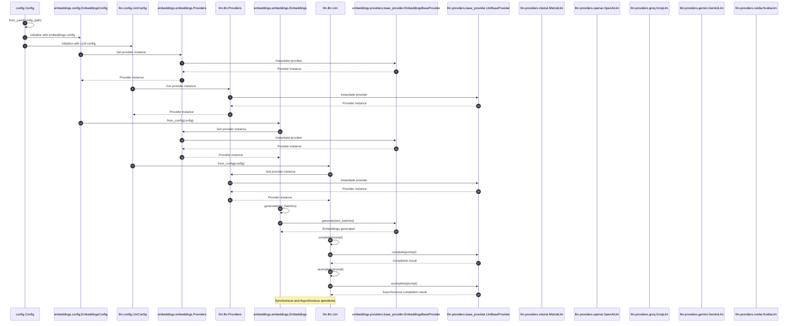

# AiCore Project
[](https://github.com/BrunoV21/AiCore/stargazers)
[](https://github.com/BrunoV21/AiCore/releases)
[](https://www.python.org/downloads/)

This project provides a framework for integrating various language models and embedding providers. It supports both synchronous and asynchronous operations for generating text completions and embeddings. 

AiCore also contains native support to augment *traditional* Llms with *reasoning* capabilities by providing them with the thinking steps generated by an open-source reasoning capable model, allowing it to generate its answers in a Reasoning Augmented way. 

This can be usefull in multiple scenarios, such as:
- ensure your agentic systems still work with the propmts you have crafted for your favourite llms while augmenting them with reasoning steps
- direct control for how long you want your reasoner to reason (via max_tokens param) and how creative it can be (reasoning temperature decoupled from generation temperature) without compromising generation settings

## Built with AiCore

**Reasoner4All**
A Hugging Face Space where you can chat with multiple reasoning augmented models.

[](https://huggingface.co/spaces/McLoviniTtt/Reasoner4All)

**CodeGraph**
A Graph representation of your codebase for effective retrieval at file/obj level *coming soon*

## Quickstart
```bash
pip install git+https://github.com/BrunoV21/AiCore@0.1.8
```

## Features
**LLM Providers:**
- OpenAI
- Mistral
- Groq
- Gemini
- Nvidia
- OpenRouter

**Embedding Providers:**
- OpenAI
- Mistral
- Groq
- Gemini
- Nvidia

To configure the application for testing, you need to set up a `config.yml` file with the necessary API keys and model names for each provider you intend to use. The `CONFIG_PATH` environment variable should point to the location of this file. Here's an example of how to set up the `config.yml` file:

```yaml
# config.yml
embeddings:
  provider: "openai" # or "mistral", "groq", "gemini", "nvidia"
  api_key: "your_openai_api_key"
  model: "your_openai_embedding_model" # Optional

llm:
  provider: "openai" # or "mistral", "groq", "gemini", "nvidia"
  api_key: "your_openai_api_key"
  model: "gpt-4o" # Optional
  temperature: 0.1
  max_tokens: 1028
```

**Reasoner Augmented Config**

To leverage the reasoning augmentation just introduce one of the supported llm configs into the reasoner field and AiCore handles the rest

```yaml
# config.yml
embeddings:
  provider: "openai" # or "mistral", "groq", "gemini", "nvidia"
  api_key: "your_openai_api_key"
  model: "your_openai_embedding_model" # Optional

llm:
  provider: "mistral" # or "openai", "groq", "gemini", "nvidia"
  api_key: "your_mistral_api_key"
  model: "mistral-small-latest" # Optional
  temperature: 0.6
  max_tokens: 2048
  reasoner:
    provider: "groq" # or openrouter or nvidia
    api_key: "your_groq_api_key"
    model: "deepseek-r1-distill-llama-70b" # or "deepseek/deepseek-r1:free" or "deepseek/deepseek-r1"
    temperature: 0.5
    max_tokens: 1024
```

Mistral models such as small-latest and large-latest perform quite well with the r1 distilled llama, which is recommend for inference speed while the full R1 will give provide you with longer reasonings.

## Installation

To install the required dependencies, run:
```bash
pip install -r requirements.txt
```

## Usage

### Language Models

You can use the language models to generate text completions. Below is an example of how to use the `MistralLlm` provider:

```python
from aicore.llm.config import LlmConfig
from aicore.llm.providers import MistralLlm

config = LlmConfig(
    api_key="your_api_key",
    model="your_model_name",
    temperature=0.7,
    max_tokens=100
)

mistral_llm = MistralLlm.from_config(config)
response = mistral_llm.complete(prompt="Hello, how are you?")
print(response)
```

### Embeddings

You can use the embeddings module to generate text embeddings. Below is an example of how to use the `OpenAiEmbeddings` provider:

```python
from aicore.embeddings.config import EmbeddingsConfig
from aicore.embeddings import Embeddings

config = EmbeddingsConfig(
    provider="openai",
    api_key="your_api_key",
    model="your_model_name"
)

embeddings = Embeddings.from_config(config)
vectors = embeddings.generate(["Hello, how are you?"])
print(vectors)
```

For asynchronous usage:

```python
import asyncio
from aicore.embeddings.config import EmbeddingsConfig
from aicore.embeddings import Embeddings

async def main():
    config = EmbeddingsConfig(
        provider="openai",
        api_key="your_api_key",
        model="your_model_name"
    )

    embeddings = Embeddings.from_config(config)
    vectors = await embeddings.agenerate(["Hello, how are you?"])
    print(vectors)

asyncio.run(main())
```

### Loading from a Config File

To load configurations from a YAML file, set the `CONFIG_PATH` environment variable and use the `Config` class to load the configurations. Here is an example:

```python
from aicore.config import Config
from aicore.llm import Llm
import os

if __name__ == "__main__":
    os.environ["CONFIG_PATH"] = "./config/config.yml"
    config = Config.from_yaml()
    llm = Llm.from_config(config.llm)
    llm.complete("Once upon a time, there was a")
```

Make sure your `config.yml` file is properly set up with the necessary configurations.

**Disclaimer**: the following diagrams and explanations were Ai Generated

## Class Diagram
*outdated*
The class diagram for this project will focus on the core components and their relationships, highlighting the configuration, embedding, and LLM modules. The key classes include `Config`, `EmbeddingsConfig`, `LlmConfig`, `Embeddings`, `Llm`, and various provider classes (`EmbeddingsBaseProvider`, `GroqEmbeddings`, `MistralEmbeddings`, `OpenAiEmbeddings`, `GeminiEmbeddings`, `NvidiaEmbeddings`, `LlmBaseProvider`, `GroqLlm`, `MistralLlm`, `OpenAiLlm`, `GeminiLlm`, `NvidiaLlm`). These classes are interconnected through inheritance, composition, and dependencies, forming the backbone of the system's architecture.

1. **Configuration Classes**:
   - `Config`: Central configuration class that manages application settings, including embeddings and LLM configurations.
   - `EmbeddingsConfig`: Configures embedding providers with details like API key, model, and base URL.
   - `LlmConfig`: Configures LLM providers with details like API key, model, base URL, temperature, and max tokens.

2. **Embeddings Module**:
   - `Embeddings`: Manages embedding generation using configured providers.
   - `Providers` (Enum): Enumeration for instantiating embedding provider classes.
   - `EmbeddingsBaseProvider`: Base class for embedding providers, defining common properties and methods.
   - `GroqEmbeddings`, `MistralEmbeddings`, `OpenAiEmbeddings`, `GeminiEmbeddings`, `NvidiaEmbeddings`: Specific implementations of `EmbeddingsBaseProvider` for different embedding providers.

3. **LLM Module**:
   - `Llm`: Manages configuration and interaction with various LLM providers.
   - `Providers` (Enum): Enumeration for instantiating LLM provider classes.
   - `LlmBaseProvider`: Base class for LLM providers, defining common methods for configuration, completion, and normalization.
   - `GroqLlm`, `MistralLlm`, `OpenAiLlm`, `GeminiLlm`, `NvidiaLlm`: Specific implementations of `LlmBaseProvider` for different LLM providers.

```mermaid
classDiagram
    %% Configuration Classes
    config.Config "1" --> "1" embeddings.config.EmbeddingsConfig : embeddings
    config.Config "1" --> "1" llm.config.LlmConfig : llm

    class config.Config {
        +EmbeddingsConfig embeddings
        +LlmConfig llm
        +from_yaml(config_path: Optional[Union[str, Path]]) : Config
    }

    class embeddings.config.EmbeddingsConfig {
        +Literal["groq", "mistral", "openai", "gemini", "nvidia"] provider
        +str api_key
        +Optional[str] model
        +Optional[str] base_url
    }

    class llm.config.LlmConfig {
        +Literal["groq", "mistral", "openai", "gemini", "nvidia"] provider
        +str api_key
        +Optional[str] model
        +Optional[str] base_url
        +float temperature
        +int max_tokens
        +field_validator(temperature: float) : float
    }

    %% Embeddings Module
    embeddings.embeddings.Embeddings "1" --> "1" embeddings.config.EmbeddingsConfig : config
    embeddings.embeddings.Embeddings "1" --> "1" embeddings.providers.base_provider.EmbeddingsBaseProvider : _provider
    embeddings.embeddings.Providers ..|> embeddings.providers.base_provider.EmbeddingsBaseProvider : get_instance

    class embeddings.embeddings.Embeddings {
        +EmbeddingsConfig config
        +EmbeddingsBaseProvider _provider
        +provider() : EmbeddingsBaseProvider
        +provider(provider: EmbeddingsBaseProvider) : void
        +vector_dimensions() : int
        +start_provider() : Self
        +from_config(config: EmbeddingsConfig) : Embeddings
        +generate(text_batches: List[str]) : void
        +agenerate(text_batches: List[str]) : void
    }

    class embeddings.embeddings.Providers {
        <<enumeration>>
        OPENAI
        MISTRAL
        GROQ
        GEMINI
        NVIDIA
        +get_instance(config: EmbeddingsConfig) : EmbeddingsBaseProvider
    }

    embeddings.providers.base_provider.EmbeddingsBaseProvider <|-- embeddings.providers.groq.GroqEmbeddings
    embeddings.providers.base_provider.EmbeddingsBaseProvider <|-- embeddings.providers.mistral.MistralEmbeddings
    embeddings.providers.base_provider.EmbeddingsBaseProvider <|-- embeddings.providers.openai.OpenAiEmbeddings
    embeddings.providers.base_provider.EmbeddingsBaseProvider <|-- embeddings.providers.gemini.GeminiEmbeddings
    embeddings.providers.base_provider.EmbeddingsBaseProvider <|-- embeddings.providers.nvidia.NvidiaEmbeddings

    class embeddings.providers.base_provider.EmbeddingsBaseProvider {
        +EmbeddingsConfig config
        +int vector_dimensions
        +Any _client
        +Any _aclient
        +from_config(config: EmbeddingsConfig) : EmbeddingsBaseProvider
        +client() : Any
        +client(client: Any) : void
        +aclient() : Any
        +aclient(aclient: Any) : void
        +generate() : void
        +agenerate() : void
    }

    class embeddings.providers.groq.GroqEmbeddings {
        +int vector_dimensions = 1024
        +set_groq() : Self
        +generate(text_batches: List[str]) : CreateEmbeddingResponse
        +agenerate(text_batches: List[str]) : CreateEmbeddingResponse
    }

    class embeddings.providers.mistral.MistralEmbeddings {
        +int vector_dimensions = 1024
        +set_mistral() : Self
        +generate(text_batches: List[str]) : EmbeddingResponse
        +agenerate(text_batches: List[str]) : EmbeddingResponse
    }

    class embeddings.providers.openai.OpenAiEmbeddings {
        +int vector_dimensions = 1536
        +set_openai() : Self
        +generate(text_batches: List[str]) : CreateEmbeddingResponse
        +agenerate(text_batches: List[str]) : CreateEmbeddingResponse
    }

    class embeddings.providers.gemini.GeminiEmbeddings {
        +int vector_dimensions = 768
        +set_gemini() : Self
        +generate(text_batches: List[str]) : CreateEmbeddingResponse
        +agenerate(text_batches: List[str]) : CreateEmbeddingResponse
    }

    class embeddings.providers.nvidia.NvidiaEmbeddings {
        +int vector_dimensions = 1024
        +set_nvidia() : Self
        +generate(text_batches: List[str]) : CreateEmbeddingResponse
        +agenerate(text_batches: List[str]) : CreateEmbeddingResponse
    }

    %% LLM Module
    llm.llm.Llm "1" --> "1" llm.config.LlmConfig : config
    llm.llm.Llm "1" --> "1" llm.providers.base_provider.LlmBaseProvider : _provider
    llm.llm.Providers ..|> llm.providers.base_provider.LlmBaseProvider : get_instance

    class llm.llm.Llm {
        +LlmConfig config
        +LlmBaseProvider _provider
        +provider() : LlmBaseProvider
        +provider(provider: LlmBaseProvider) : void
        +start_provider() : Self
        +from_config(config: LlmConfig) : Llm
        +tokenizer() : Any
        +complete(prompt: Union[str, BaseModel, RootModel], system_prompt: Optional[str], prefix_prompt: Optional[str], img_path: Optional[Union[Union[str, Path], List[Union[str, Path]]]], json_output: bool, stream: bool) : Union[str, Dict]
        +acomplete(prompt: Union[str, BaseModel, RootModel], system_prompt: Optional[str], prefix_prompt: Optional[str], img_path: Optional[Union[Union[str, Path], List[Union[str, Path]]]], json_output: bool, stream: bool) : Union[str, Dict]
    }

    class llm.llm.Providers {
        <<enumeration>>
        OPENAI
        MISTRAL
        GROQ
        GEMINI
        NVIDIA
        +get_instance(config: LlmConfig) : LlmBaseProvider
    }

    llm.providers.base_provider.LlmBaseProvider <|-- llm.providers.groq.GroqLlm
    llm.providers.base_provider.LlmBaseProvider <|-- llm.providers.mistral.MistralLlm
    llm.providers.base_provider.LlmBaseProvider <|-- llm.providers.openai.OpenAiLlm
    llm.providers.base_provider.LlmBaseProvider <|-- llm.providers.gemini.GeminiLlm
    llm.providers.base_provider.LlmBaseProvider <|-- llm.providers.nvidia.NvidiaLlm

    class llm.providers.base_provider.LlmBaseProvider {
        +LlmConfig config
        +Any _client
        +Any _aclient
        +Dict _completion_args
        +Any _completion_fn
        +Any _acompletion_fn
        +Any _normalize_fn
        +Any _tokenizer_fn
        +from_config(config: LlmConfig) : LlmBaseProvider
        +client() : Any
        +client(client: Any) : void
        +aclient() : Any
        +aclient(aclient: Any) : void
        +completion_args() : Dict
        +completion_args(args: Dict) : void
        +completion_fn() : Any
        +completion_fn(completion_fn: Any) : void
        +acompletion_fn() : Any
        +acompletion_fn(acompletion_fn: Any) : void
        +normalize_fn() : Any
        +normalize_fn(normalize_fn: Any) : void
        +tokenizer_fn() : Any
        +tokenizer_fn(tokenizer_fn: Any) : void
        +get_default_tokenizer(model_name: str) : str
        +_message_content(prompt: str, img_b64_str: Optional[List[str]]) : List[Dict]
        +_message_body(prompt: str, role: Literal["user", "system", "assistant"], img_b64_str: Optional[List[str]]) : Dict
        +completion_args_template(prompt: str, system_prompt: Optional[str], prefix_prompt: Optional[str], img_b64_str: Optional[Union[str, List[str]]], stream: bool) : Dict
        +_prepare_completion_args(prompt: str, system_prompt: Optional[str], prefix_prompt: Optional[str], img_path: Optional[Union[Union[str, Path], List[Union[str, Path]]]], stream: bool) : Dict
        +_stream(stream) : str
        +_astream(stream) : str
        +model_to_str(model: Union[BaseModel, RootModel]) : str
        +extract_json(output: str) : Dict
        +complete(prompt: Union[str, BaseModel, RootModel], system_prompt: Optional[str], prefix_prompt: Optional[str], img_path: Optional[Union[Union[str, Path], List[Union[str, Path]]]], json_output: bool, stream: bool) : Union[str, Dict]
        +acomplete(prompt: Union[str, BaseModel, RootModel], system_prompt: Optional[str], prefix_prompt: Optional[str], img_path: Optional[Union[Union[str, Path], List[Union[str, Path]]]], json_output: bool, stream: bool) : Union[str, Dict]
    }

    class llm.providers.groq.GroqLlm {
        +set_groq() : Self
    }

    class llm.providers.mistral.MistralLlm {
        +set_mistral() : Self
    }

    class llm.providers.openai.OpenAiLlm {
        +set_openai() : Self
    }

    class llm.providers.gemini.GeminiLlm {
        +set_gemini() : Self
    }

    class llm.providers.nvidia.NvidiaLlm {
        +set_nvidia() : Self
    }
```



## Sequence Diagram
*outdated*
The sequence diagram will illustrate the interactions between the core components of the system, focusing on the configuration and usage of embeddings and LLM providers. The diagram will highlight the following key interactions:

1. **Configuration Loading**: The `Config` class loads the configuration from a YAML file, which includes settings for both embeddings and LLM providers.
2. **Embeddings Configuration**: The `EmbeddingsConfig` class specifies the provider details for embedding providers.
3. **LLM Configuration**: The `LlmConfig` class specifies the provider details for LLM providers.
4. **Provider Instantiation**: The `Providers` enum in both the embeddings and LLM modules instantiates the appropriate provider classes based on the configuration.
5. **Embeddings Generation**: The `Embeddings` class manages embedding generation using the configured provider.
6. **LLM Completion**: The `Llm` class manages interactions with LLM providers for synchronous and asynchronous completions.

The diagram will use full module paths to ensure clarity and avoid ambiguity, highlighting the key messages and events critical to the system’s main functionalities.


## License

This project is licensed under the Apache 2.0 License.
