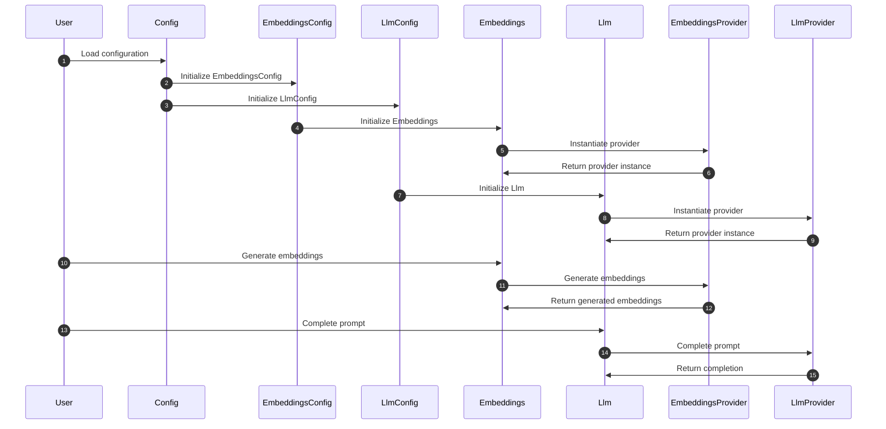

# AiCore Project

This project provides a framework for integrating various language models and embedding providers. It supports both synchronous and asynchronous operations for generating text completions and embeddings. The current implementation includes support for OpenAI, Mistral and Groq providers.

## Installation

To install the required dependencies, run:
```bash
pip install -r requirements.txt
```

## Usage

### Language Models

You can use the language models to generate text completions. Below is an example of how to use the `MistralLlm` provider:

```python
from aicore.llm.config import LlmConfig
from aicore.llm.providers import MistralLlm

config = LlmConfig(
    api_key="your_api_key",
    model="your_model_name",
    temperature=0.7,
    max_tokens=100
)

mistral_llm = MistralLlm.from_config(config)
response = mistral_llm.complete(prompt="Hello, how are you?")
print(response)
```

### Embeddings

You can use the embeddings module to generate text embeddings. Below is an example of how to use the `OpenAiEmbeddings` provider:

```python
from aicore.embeddings.config import EmbeddingsConfig
from aicore.embeddings import Embeddings

config = EmbeddingsConfig(
    provider="openai",
    api_key="your_api_key",
    model="your_model_name"
)

embeddings = Embeddings.from_config(config)
vectors = embeddings.generate(["Hello, how are you?"])
print(vectors)
```

For asynchronous usage:

```python
import asyncio
from aicore.embeddings.config import EmbeddingsConfig
from aicore.embeddings import Embeddings

async def main():
    config = EmbeddingsConfig(
        provider="openai",
        api_key="your_api_key",
        model="your_model_name"
    )

    embeddings = Embeddings.from_config(config)
    vectors = await embeddings.agenerate(["Hello, how are you?"])
    print(vectors)

asyncio.run(main())
```

### Loading from a Config File

To load configurations from a YAML file, set the `CONFIG_PATH` environment variable and use the `Config` class to load the configurations. Here is an example:

```python
from aicore.config import Config
from aicore.llm import Llm
import os

if __name__ == "__main__":
    os.environ["CONFIG_PATH"] = "./config/config.yml"
    config = Config.from_yaml()
    llm = Llm.from_config(config.llm)
    llm.complete("Once upon a time, there was a")
```

Make sure your `config.yml` file is properly set up with the necessary configurations.

**Disclaimer**: the following diagrams and explanations were Ai Generated

## Class Diagram

The class diagram for this project will focus on the core components and their relationships, highlighting the configuration, embedding, and LLM functionalities. The key classes include `Config`, `EmbeddingsConfig`, `LlmConfig`, `Embeddings`, `Llm`, and various provider classes (`BaseProvider`, `GroqEmbeddings`, `MistralEmbeddings`, `OpenAiEmbeddings`, `GroqLlm`, `MistralLlm`, `OpenAiLlm`). These classes are interconnected through inheritance, composition, and dependencies, forming the backbone of the project's architecture.

1. **Config Class**: This is the central configuration class that manages the application settings, including embeddings and LLM configurations. It loads settings from a YAML file and initializes the `EmbeddingsConfig` and `LlmConfig` classes.

2. **EmbeddingsConfig and LlmConfig Classes**: These classes are responsible for configuring the embedding and LLM providers, respectively. They specify details such as API keys, models, and other parameters required for the providers to function.

3. **Embeddings and Llm Classes**: These classes manage the embedding generation and LLM interactions. They use the configuration classes to initialize the appropriate providers and handle both synchronous and asynchronous operations.

4. **BaseProvider Class**: This is the base class for all provider implementations. It defines common properties and methods for client initialization and embedding generation or LLM completions.

5. **Specific Provider Classes**: These classes (`GroqEmbeddings`, `MistralEmbeddings`, `OpenAiEmbeddings`, `GroqLlm`, `MistralLlm`, `OpenAiLlm`) are specific implementations of the `BaseProvider` class for different providers. They handle client setup and embedding generation or LLM completions for their respective providers.

The diagram will show the inheritance hierarchy and the relationships between these classes, highlighting how the configuration classes are used to initialize the provider classes, which in turn are used by the `Embeddings` and `Llm` classes to perform their respective functions.

```mermaid
classDiagram
    class Config {
        +EmbeddingsConfig embeddings
        +LlmConfig llm
        +from_yaml(config_path: Optional[Union[str, Path]] = None) -> Config
    }

    class EmbeddingsConfig {
        +Literal provider
        +str api_key
        +Optional[str] model
        +Optional[str] base_url
    }

    class LlmConfig {
        +Literal provider
        +str api_key
        +Optional[str] model
        +Optional[str] base_url
        +float temperature
        +int max_tokens
        +field_validator(temperature: float) -> float
    }

    class Embeddings {
        +EmbeddingsConfig config
        +BaseProvider _provider
        +provider: BaseProvider
        +vector_dimensions: int
        +start_provider() -> Self
        +from_config(config: EmbeddingsConfig) -> Embeddings
        +generate(text_batches: List[str])
        +agenerate(text_batches: List[str])
    }

    class Llm {
        +LlmConfig config
        +BaseProvider _provider
        +provider: BaseProvider
        +start_provider() -> Self
        +from_config(config: LlmConfig) -> Llm
        +tokenizer: Any
        +complete(prompt: Union[str, BaseModel, RootModel], system_prompt: Optional[str] = None, prefix_prompt: Optional[str] = None, img_path: Optional[Union[Union[str, Path], List[Union[str, Path]]]] = None, json_output: bool = False, stream: bool = True) -> Union[str, Dict]
        +acomplete(prompt: Union[str, BaseModel, RootModel], system_prompt: Optional[str] = None, prefix_prompt: Optional[str] = None, img_path: Optional[Union[Union[str, Path], List[Union[str, Path]]]] = None, json_output: bool = False, stream: bool = True) -> Union[str, Dict]
    }

    class BaseProvider {
        +EmbeddingsConfig config
        +int vector_dimensions
        +Any _client
        +Any _aclient
        +from_config(config: EmbeddingsConfig) -> BaseProvider
        +client: Any
        +aclient: Any
        +generate()
        +agenerate()
    }

    class GroqEmbeddings {
        +int vector_dimensions = 1024
        +set_groq() -> Self
        +generate(text_batches: List[str]) -> CreateEmbeddingResponse
        +agenerate(text_batches: List[str]) -> CreateEmbeddingResponse
    }

    class MistralEmbeddings {
        +int vector_dimensions = 1024
        +set_mistral() -> Self
        +generate(text_batches: List[str]) -> EmbeddingResponse
        +agenerate(text_batches: List[str]) -> EmbeddingResponse
    }

    class OpenAiEmbeddings {
        +int vector_dimensions = 1536
        +set_openai() -> Self
        +generate(text_batches: List[str]) -> CreateEmbeddingResponse
        +agenerate(text_batches: List[str]) -> CreateEmbeddingResponse
    }

    class GroqLlm {
        +set_groq() -> Self
    }

    class MistralLlm {
        +set_mistral() -> Self
    }

    class OpenAiLlm {
        +set_openai() -> Self
    }

    Config "1" --> "1" EmbeddingsConfig : embeddings
    Config "1" --> "1" LlmConfig : llm
    Embeddings "1" --> "1" EmbeddingsConfig : config
    Llm "1" --> "1" LlmConfig : config
    Embeddings "1" --> "1" BaseProvider : _provider
    Llm "1" --> "1" BaseProvider : _provider
    BaseProvider <|-- GroqEmbeddings
    BaseProvider <|-- MistralEmbeddings
    BaseProvider <|-- OpenAiEmbeddings
    BaseProvider <|-- GroqLlm
    BaseProvider <|-- MistralLlm
    BaseProvider <|-- OpenAiLlm
```



## Sequence Diagram

The sequence diagram will focus on the interactions between the core components of the system, specifically the `Config`, `Embeddings`, `Llm`, and their respective providers. The diagram will highlight the key messages and events critical to the system�s main functionalities, such as configuration loading, provider instantiation, and the generation of embeddings or completions.

1. **Config**: This component is central to the system as it loads and manages application settings, including embeddings and LLM configurations. It initializes the settings used by other components.
2. **Embeddings**: This component manages embedding generation using configured providers. It supports both synchronous and asynchronous operations.
3. **Llm**: This component manages configuration and interaction with various LLM providers, handling both synchronous and asynchronous completions.
4. **Providers**: These are responsible for instantiating provider classes based on the configuration. They play a key role in selecting the appropriate embedding or LLM provider.

The diagram will show the flow of communication between these components, starting from loading the configuration, instantiating the providers, and generating embeddings or completions. Utility or helper modules are excluded to maintain clarity and focus on the high-level communication paths.



## License

This project is licensed under the Apache 2.0 License.