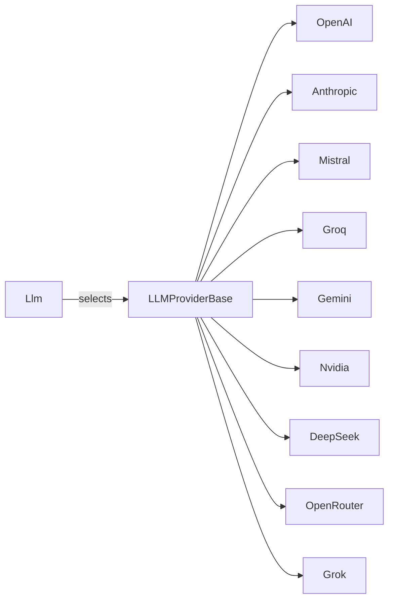

# AiCore Architecture

This section provides a comprehensive explanation of the AiCore framework's structure, including its core modules, extensibility, and the interactions between components.

## Architecture Diagram

```mermaid
flowchart TD
    subgraph User
        U1[User Code / Integrations]
        U2[Config Loader]
    end
    subgraph Core
        C1[Config Module]
        C2[Llm Module]
        C3[Embeddings Module]
        C4[Observability Module]
    end
    subgraph Providers
        P1[LLM Providers]
        P2[Embedding Providers]
    end
    subgraph Observability
        O1[Collector]
        O2[Dashboard]
        O3[Storage (SQL/Local)]
    end
    U1 --> U2
    U2 --> C1
    C1 --> C2
    C1 --> C3
    C2 --> P1
    C3 --> P2
    C2 --> C4
    C3 --> C4
    C4 --> O1
    O1 --> O2
    O1 --> O3
```

## Core Modules

- **Config Module (`aicore/config.py`)**: Loads and validates configuration from YAML files or environment variables. Centralizes settings for LLMs, embeddings, and observability.
- **LLM Module (`aicore/llm/`)**: Provides the main `Llm` abstraction, provider selection, reasoning augmentation, and tool calling (MCP). Supports both sync and async operations.
- **Embeddings Module (`aicore/embeddings/`)**: Offers a unified interface for embedding providers, with batching and provider selection.
- **Observability Module (`aicore/observability/`)**: Tracks all operations, usage, and costs. Includes a collector for file/DB storage and a dashboard for analytics.

## Provider Abstraction

AiCore uses a provider interface pattern for both LLM and embedding modules:

- **LLM Providers**: OpenAI, Anthropic, Mistral, Groq, Gemini, NVIDIA, DeepSeek, OpenRouter, Grok, etc.
- **Embedding Providers**: OpenAI, Mistral, Groq, Gemini, NVIDIA.
- All providers inherit from a base provider class, enabling easy extension.



## Observability & Analytics

- **Collector**: Captures all LLM/embedding operations, arguments, responses, and metrics.
- **Dashboard**: Visualizes usage, cost, latency, and agent analytics (powered by Dash).
- **Storage**: Supports both local file and SQL database backends.

## Advanced Features

- **Reasoning Augmentation**: Optional reasoning LLM can be chained to generate intermediate reasoning steps.
- **Tool Calling (MCP)**: Integrates with Model Control Protocol for tool execution and agent workflows.
- **Sync/Async Support**: All major operations are available in both synchronous and asynchronous forms.

## Extensibility

- **Add Providers**: Implement the provider interface and register in the appropriate module.
- **Custom Observability**: Extend collector or dashboard for custom analytics or storage.
- **Agent Integration**: Use the unified API and observability hooks for agent frameworks.

## Component Interactions

1. **Configuration**: User code loads configuration, which instantiates LLM and embedding objects.
2. **Provider Selection**: Each object selects the appropriate provider implementation.
3. **Operation Tracking**: All calls are tracked by the observability module.
4. **Analytics**: Dashboard visualizes usage, cost, and performance.
5. **Advanced Features**: Reasoning and tool calling are handled via dedicated submodules.

---

For a high-level summary, see the [Overview](/overview.md) section.