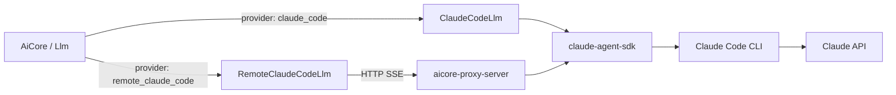
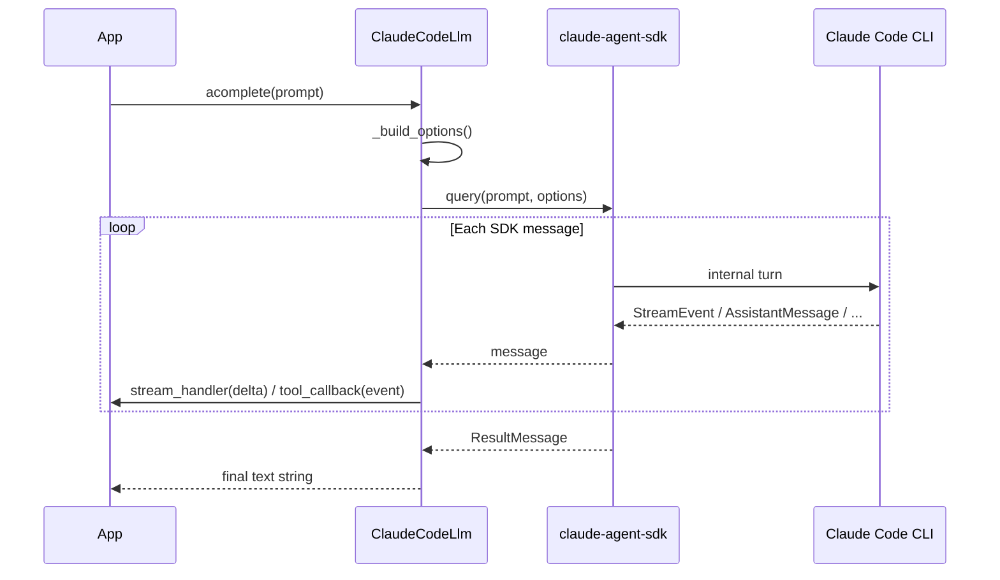
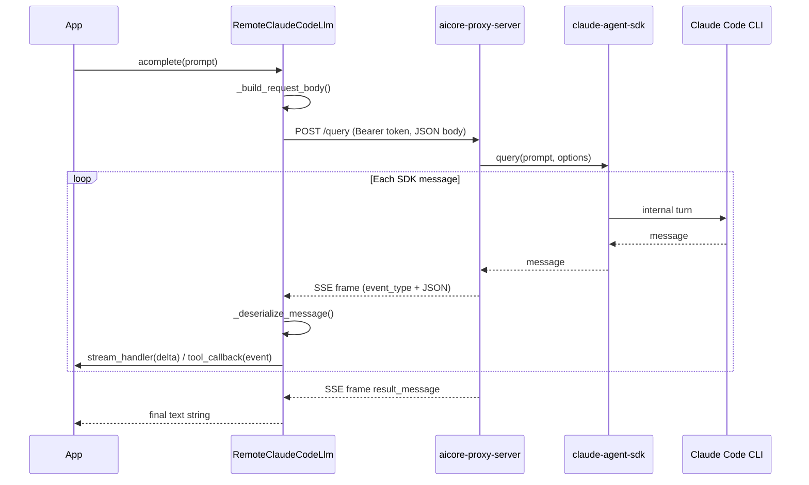

# Claude Code Providers

AiCore ships two LLM providers built on the [Claude Agents Python SDK](https://platform.claude.com/docs/en/agent-sdk/python) that allow you to route completions through your **Claude subscription** without an Anthropic API key.



---

## ClaudeCodeBase

Both providers inherit from `ClaudeCodeBase`, a shared abstract base in `aicore/llm/providers/claude_code/local.py`. It provides:

| Method | Description |
|---|---|
| `_to_prompt_string()` | Flattens `str`, `BaseModel`, `RootModel`, and `list` inputs into a single string |
| `_extract_stream_delta()` | Extracts `text_delta` text from a `StreamEvent` |
| `_extract_text_and_usage()` | Iterates collected messages and returns `(text, input_tokens, output_tokens, cost, session_id)` |
| `_process_message()` | Processes a single SDK message — fires `tool_callback`, emits `TOOL_CALL_START_TOKEN` / `TOOL_CALL_END_TOKEN`, and streams text deltas |
| `connect_to_mcp()` | No-op — MCP servers are passed directly to `ClaudeAgentOptions` |
| `validate_config()` | No-op — auth is external |

---

## ClaudeCodeLlm

**File:** `aicore/llm/providers/claude_code/local.py`
**Provider name:** `"claude_code"`

Drives the Claude Code CLI directly via `claude-agent-sdk`'s `query()` function. Each call is **stateless** — a fresh SDK session is created per `acomplete()` call; multi-turn behaviour is handled internally via `max_turns`.

### How a call works



### Key behaviour

- `CLAUDECODE` and `CLAUDE_CODE_ENTRYPOINT` env vars are temporarily unset during the call to prevent recursive CLI invocations.
- Cost is taken from `ResultMessage.total_cost_usd` rather than a pricing table.
- If `cli_path` is set it overrides the `claude` binary on PATH.

---

## RemoteClaudeCodeLlm

**File:** `aicore/llm/providers/claude_code/remote.py`
**Provider name:** `"remote_claude_code"`

Connects to a running `aicore-proxy-server` over HTTP SSE, reconstructing the SDK message stream locally. The call path is identical to `ClaudeCodeLlm` from the caller's perspective.

### How a call works



### SSE event types

| Event type | SDK type reconstructed |
|---|---|
| `stream_event` | `StreamEvent` |
| `assistant_message` | `AssistantMessage` |
| `user_message` | `UserMessage` |
| `result_message` | `ResultMessage` |
| `system_message` | `SystemMessage` |
| `error` | raises `RuntimeError` |

### Health check

On initialisation `RemoteClaudeCodeLlm` performs a `GET /health` check against the proxy. Disable it with `skip_health_check: true` in the config when you know the server is up.

---

## Proxy Server (`aicore-proxy-server`)

**File:** `aicore/scripts/claude_code_proxy_server.py`
**Entry point:** `aicore-proxy-server` (registered via `setup.py` `console_scripts`)

A FastAPI SSE server that wraps `claude-agent-sdk.query()`. It handles bearer token auth, optional tunnel setup, CWD whitelisting, and active-stream tracking.

See the [full proxy server reference](../providers/claude-code.md#proxy-server) for CLI options, tunnel modes, and API endpoints.

---

## Package layout

```
aicore/
├── llm/
│   └── providers/
│       └── claude_code/
│           ├── __init__.py   ← re-exports ClaudeCodeLlm, RemoteClaudeCodeLlm, ClaudeCodeBase
│           ├── local.py      ← ClaudeCodeBase + ClaudeCodeLlm
│           └── remote.py     ← RemoteClaudeCodeLlm
└── scripts/
    └── claude_code_proxy_server.py   ← aicore-proxy-server entry point
```

---

## Related Documentation

- [Claude Code Provider reference](../providers/claude-code.md)
- [Claude Code Quickstart](../quickstart/claude-code.md)
- [LLM Overview](overview.md)
- [MCP Integration](mcp.md)
- [Configuration](../config/llmconfig.md)
