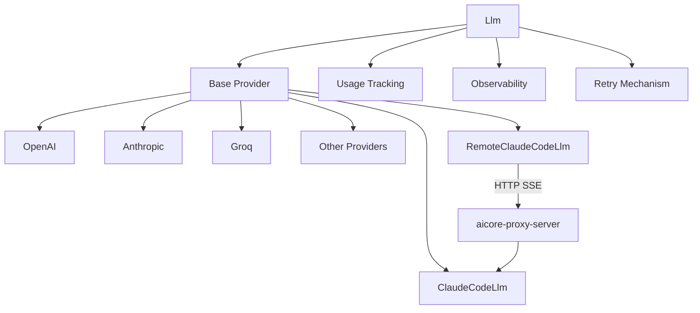

# LLM Module Overview

The LLM module provides a unified interface for interacting with various large language model providers through a provider-agnostic design. It supports both synchronous and asynchronous operations, streaming responses, and advanced features like reasoning assistants.

## Core Architecture



## Key Features

- **Provider Agnostic**: Supports multiple LLM providers through a common interface
- **Async-First**: Designed for high-performance asynchronous operations
- **Streaming Support**: Real-time streaming of model responses
- **Usage Tracking**: Built-in token counting and cost estimation
- **Reasoning Assistants**: Optional reasoning models for complex tasks
- **Observability**: Integrated metrics collection
- **Retry Mechanism**: Automatic retries for transient failures
- **Configuration**: Flexible provider-specific settings

## Supported Providers

```python
from aicore.llm.llm import Providers

# List all available providers
print(Providers.__members__)
```

## Basic Usage

### Synchronous Completion

```python
from aicore.llm.config import LlmConfig
from aicore.llm.llm import Llm

config = LlmConfig(
    provider="openai",
    api_key="your_api_key",
    model="gpt-4o"
)

llm = Llm(config=config)
response = llm.complete("Hello world")
print(response)
```

### Asynchronous Completion

```python
import asyncio

async def main():
    response = await llm.acomplete("Hello world", stream=True)

asyncio.run(main())
```

## Advanced Features

### Streaming Responses

```python
response = llm.complete("Explain quantum computing", stream=True)
```

### Usage Tracking

```python
print(f"Total tokens used: {llm.usage.total_tokens}")
print(f"Estimated cost: ${llm.usage.total_cost:.4f}")
```

### Observability Integration

```python
from aicore.observability import LlmOperationCollector

collector = LlmOperationCollector()
collector.record_completion(
    completion_args={"model": config.model},
    operation_type="completion",
    provider=config.provider,
    response=response
)
```

## Related Documentation

- [Configuration Guide](../config/llmconfig.md)
- [Provider Details](../providers/)
- [Claude Code Providers](claude-code.md)
- [Usage Tracking](usage.md)
- [Retry Mechanism](retry.md)
- [Models Metadata](models_metadata.md)