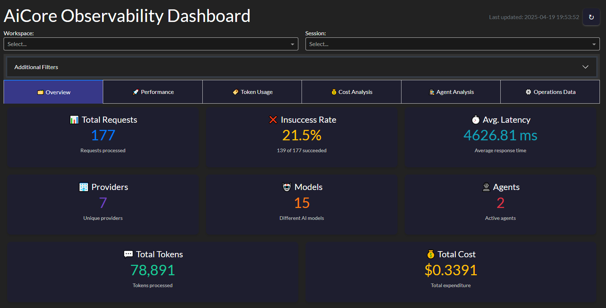

# Observability Dashboard

The AiCore observability dashboard provides real-time monitoring and analytics for LLM operations, offering insights into performance, costs, and usage patterns.

## Key Features

- **Interactive Visualizations**: Dynamic charts for performance metrics
- **Real-time Monitoring**: Live updates of LLM operations
- **Historical Analysis**: View trends over customizable time periods
- **Cost Tracking**: Monitor API usage costs by provider/model
- **Agent Monitoring**: Track agent-specific metrics and performance
- **Multi-source Data**: Supports both live operations and historical data

## Getting Started

### Prerequisites

```bash
pip install core-for-ai[observability]
```

### Basic Usage

```python
from aicore.observability.dashboard import ObservabilityDashboard

# Create and launch dashboard
dashboard = ObservabilityDashboard()
dashboard.run_server(host="0.0.0.0", port=8050)  # Default port: 8050
```

### Configuration Options

| Parameter | Description | Default |
|-----------|-------------|---------|
| `from_local_records_only` | Use only local JSON records | False |
| `database_uri` | Custom SQL database URI | None |
| `refresh_interval` | Dashboard refresh rate (ms) | 5000 |

## Dashboard Components

### Overview Tab

- **Request Volume**: Operations per time period
- **Success Rate**: Successful vs failed requests
- **Provider Distribution**: Usage by LLM provider
- **Model Distribution**: Breakdown by model

### Performance Tab
- **Latency Metrics**: P50, P90, P95 response times
- **Throughput**: Requests per minute/second
- **Error Analysis**: Error types and frequencies

### Cost Analysis Tab
- **Cost Over Time**: Daily/weekly/monthly spend
- **Cost by Provider**: Breakdown by API provider
- **Token Efficiency**: Cost per token metrics

### Agent Monitoring Tab
- **Agent Activity**: Operations by agent/workspace
- **Action Tracking**: Most frequent actions
- **Custom Metrics**: User-defined agent metrics

## Advanced Usage

### Custom Data Sources

```python
from aicore.observability.dashboard import ObservabilityDashboard
from aicore.observability.collector import LlmOperationCollector

# Load specific data range
collector = LlmOperationCollector()
df = collector.polars_from_db(start_date="2023-01-01", end_date="2023-12-31")

# Create dashboard with custom data
dashboard = ObservabilityDashboard(custom_data=df)
```

### Embedding in Existing Apps

```python
from fastapi import FastAPI
from aicore.observability.dashboard import get_dash_app

app = FastAPI()
dash_app = get_dash_app()

@app.get("/dashboard")
async def serve_dashboard():
    return dash_app.index()
```

## Troubleshooting

**Dashboard not loading data:**
1. Verify database connection settings
2. Check collector is recording operations
3. Ensure required ports are open

**Performance issues:**
- Reduce refresh interval
- Limit historical data range
- Use `from_local_records_only` for smaller datasets

## Related Documentation

- [Observability Overview](overview.md)
- [SQL Integration](sql.md)
- [Polars Integration](polars.md)
- [Operation Collector](collector.md)