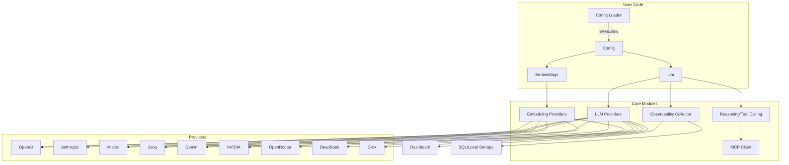

# AiCore Framework Overview

This section provides a high-level examination of the AiCore framework, focusing on its architecture, core modules, and the interactions between its components.

## What is AiCore?

**AiCore** is a modular Python framework designed to unify interaction with multiple LLM (Large Language Model) and embedding providers. It features built-in observability, advanced configuration, and extensibility for production-grade AI applications.

## Key Architectural Concepts

- **Unified API**: Interact with multiple LLM and embedding providers through a single, consistent interface.
- **Modular Design**: Core modules for LLMs, embeddings, observability, and configuration.
- **Provider Abstraction**: Easily extend support for new providers via a provider interface pattern.
- **Observability**: Built-in tracking, metrics, and dashboard for monitoring usage, cost, and performance.
- **Advanced Features**: Reasoning augmentation, tool calling (MCP), and both sync/async operation.

## High-Level Architecture Diagram

## Main Components

- **Config Loader**: Loads configuration from YAML files or environment variables.
- **Llm & Embeddings**: Main abstractions for interacting with LLM and embedding providers.
- **Providers**: Pluggable implementations for each supported LLM/embedding service.
- **Observability**: Tracks all operations, usage, and costs; provides a dashboard for analytics.
- **Reasoning/Tool Calling**: Supports advanced features like reasoning augmentation and Model Control Protocol (MCP) tool calls.

## Component Interactions

- The user loads configuration, which instantiates LLM and embedding objects.
- Each LLM/embedding object selects the appropriate provider implementation.
- All operations are tracked by the observability module, which can store data locally or in a SQL database.
- The dashboard visualizes usage, cost, and performance metrics.
- Advanced features (reasoning, tool calling) are handled via dedicated submodules and protocols.

## Extensibility

- **Add new providers** by implementing the provider interface and registering it in the appropriate module.
- **Customize observability** by configuring storage backends or extending dashboard analytics.
- **Integrate with agent frameworks** via the unified API and observability hooks.

---

For a more detailed breakdown, see the [Architecture](/architecture.md) section.